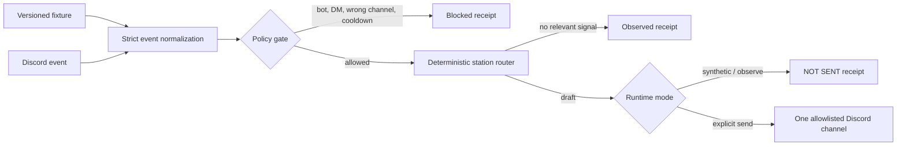

# Ambient Relay

Ambient Relay is a local Discord automation lab for proving the dangerous part first: **which event would trigger which reply, under which policy, without sending anything**.

Its default command replays a versioned synthetic Discord event stream through a deterministic router. It needs no install, token, account, network connection, AI provider, or `.env` file. Every event ends in a body-free receipt and every drafted reply is visibly marked `NOT SENT`.

```text
┌─ EVENT evt-build-01
│ policy   allowed.route-evaluation
│ route    station.builder
│ receipt  relay_ebf228cda1e1abb9  /  drafted
│ event    d902966f5b3f…882f6a4e
│ outbound NOT SENT  /  dry-run.synthetic-default
└───────────────────────────────────────────────────────────────────────────
```

The complete checked-in terminal proof is [artifacts/demo-session.txt](artifacts/demo-session.txt). CI regenerates it in memory and fails if it drifts from the executable replay.

## What is real

| Boundary | Status | Network | Sends messages |
| --- | --- | --- | --- |
| Synthetic event replay | Implemented and tested | No | No |
| Event validation, bot/DM/allowlist/cooldown policy | Implemented and tested | No | No |
| Deterministic Builder, Care, and Guide stations | Implemented and tested | No AI involved | No by default |
| Metadata-only receipts | Implemented and tested | No | No |
| Discord observe adapter | Implemented, **not tested with a live Discord account** | Yes | No |
| Discord send adapter | Implemented, **not tested with a live Discord account** | Yes | Only after exact acknowledgement and one-channel allowlist |
| LLM or OpenRouter responses | Not implemented | — | — |
| Redis, long-term memory, cost prediction, dashboards | Not implemented | — | — |

The station replies are fixed local templates. “Deterministic” does not mean intelligent, and a receipt proves what this process decided—not that Discord accepted or preserved an action.

## Run the proof

Requires Node.js 22.13 or newer.

```bash
npm start
```

That command uses only Node's standard library. Installing dependencies is optional for replay; the single optional runtime dependency exists only for the live Discord adapter.

```bash
npm ci --ignore-scripts
npm test
npm run check
```

Useful proof commands:

```bash
npm run demo              # human-readable terminal trace
npm run demo:json         # machine-readable decisions and receipts
npm run artifact:check    # prove the checked-in transcript is current
```

## How routing works



No random interjections remain. Technical terms route to Builder, emotional language routes to Care, and questions or direct mentions route to Guide. Ties use a fixed station order. User content is used in memory for routing and hashing but is never interpolated into a reply.

Care is a fixed acknowledgement template, not a mental-health, moderation, or crisis-response system. Do not use the experimental live adapter as a substitute for trained human support or an established escalation path.

## Live boundary

Live mode is deliberately inconvenient. It is not part of the verified demo.

1. Install the optional dependency with `npm ci --ignore-scripts`.
2. In the Discord Developer Portal, enable the privileged **Message Content** intent for the bot.
3. Give the bot only the permissions required for the chosen channel: View Channel, Read Message History, and—only for send mode—Send Messages.
4. Provide runtime values through your shell or secret manager. [.env.example](.env.example) is blank/comment-only and the application never loads it automatically.
5. Set `AMBIENT_RELAY_MODE` to `discord-observe` or `discord-send`, and set exact guild and channel IDs. Observe mode connects and receives content but never sends.
6. Send mode additionally requires `AMBIENT_RELAY_SEND_ACK` to equal `I_ACCEPT_ONE_CHANNEL_SENDS` exactly.
7. Start with `npm run live`.

The adapter ignores all non-allowlisted guilds/channels before routing, ignores bots and DMs at policy, suppresses every allowed-mention expansion, and logs reduced receipts rather than message or reply bodies. It has no remote deployment story and should be run from a controlled local machine only.

## Project map

- `src/core/` — pure normalization, policy, routing, hashing, and receipts
- `src/fixtures/` — public synthetic Discord-shaped events
- `src/live/discord-adapter.js` — isolated, dynamically imported Discord boundary
- `src/presentation/terminal.js` — deterministic proof renderer
- `test/` — credential-free Node test suite
- [ARCHITECTURE.md](ARCHITECTURE.md) — invariants and data flow
- [SECURITY.md](SECURITY.md) — baseline findings, mitigations, and residual risk
- [RUNBOOK.md](RUNBOOK.md) — safe operation and incident steps

Licensed under the [MIT License](LICENSE).
